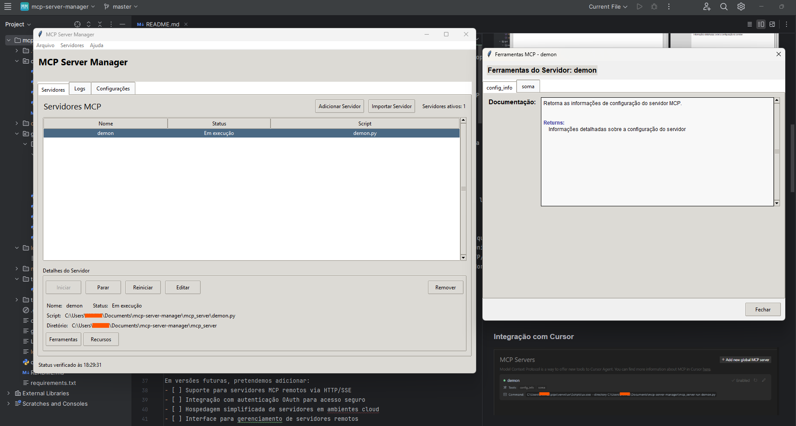
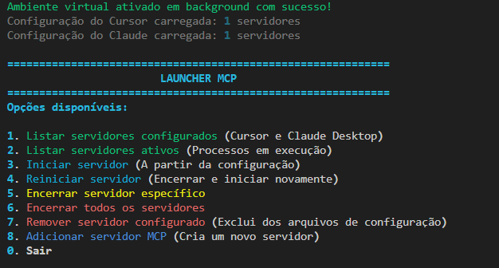
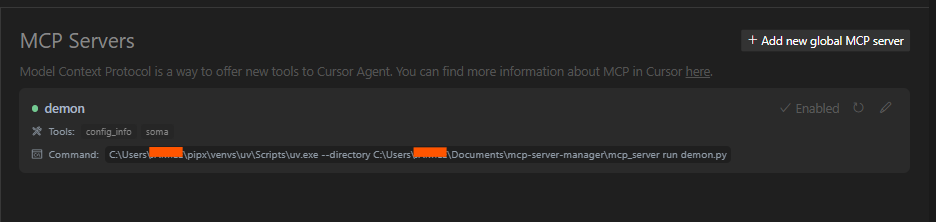

# MCP Server Manager

Um gerenciador de servidores MCP (Model Control Protocol) para Cursor e Claude Desktop, proporcionando interfaces de linha de comando (CLI) e gráfica (GUI) para facilitar o gerenciamento de servidores MCP.

## 📋 Funcionalidades

- **Gerenciamento de Servidores MCP:** Iniciar, parar, reiniciar e monitorar servidores MCP
- **Interface Dupla:** Interface de linha de comando e interface gráfica
- **Configuração Automática:** Integração com Cursor e Claude Desktop
- **Detecção de Processos:** Identificação automática de servidores em execução
- **Quick Setup:** Sistema de configuração rápida para novos ambientes

## 📸 Screenshots

### Interface Gráfica (GUI)


### Interface de Linha de Comando (CLI)


### Integração com Cursor


## 🛠️ Tecnologias Utilizadas

- Python 3.10+
- GUI com Tkinter e ttkthemes
- CLI com Rich para interface colorida e formatada
- Gestão de configuração TOML

## 🚀 Instalação

### Requisitos
- Python 3.10 ou superior
- Pip (gerenciador de pacotes Python)

### Passos para Instalação

1. Clone o repositório:
   ```
   git clone https://github.com/marcellobatiista/mcp-server-manager.git
   cd mcp-server-manager
   ```

2. Instale as dependências:
   ```
   pip install -r requirements.txt
   ```

3. Execute o setup rápido:
   ```
   python quick_setup.py
   ```

## 📚 Como Usar

### Comando Global 'mcp'

Após executar o `quick_setup.py` com sucesso, você pode iniciar a interface gráfica do MCP a partir de qualquer local usando o comando:
```
mcp
```
> ℹ️ **Observação**: É necessário abrir um novo prompt de comando após a instalação para que o comando funcione.

### Interface de Linha de Comando (CLI)

Para iniciar a interface CLI:
```
.\cli-launcher.bat
```

Ou diretamente pelo Python:
```
python cli/launcher.py
```

### Interface Gráfica (GUI)

Para iniciar a interface gráfica:
```
.\gui-launcher.bat
```

Ou diretamente pelo Python:
```
python gui/app.py
```

## 📁 Estrutura do Projeto

```
mcp-server-manager/
│
├── cli/                         # Módulos de interface de linha de comando
│   ├── launcher.py              # Interface principal CLI
│   ├── add_mcp.py               # Utilitário para adicionar novos servidores
│   └── config_util.py           # Utilitário de configuração para Cursor e Claude Desktop
│
├── gui/                         # Módulos de interface gráfica
│   ├── app.py                   # Aplicação principal GUI
│   ├── server_manager.py        # Gerenciamento de servidores na GUI
│   ├── config_manager.py        # Gerenciamento de configurações na GUI
│   ├── utils.py                 # Utilitários para a interface gráfica
│   └── assets/                  # Recursos gráficos (ícones, imagens, etc.)
│
├── config/                      # Arquivos de configuração
│
├── tools/                       # Scripts auxiliares e utilitários
│
└── logs/                        # Registros de execução
```

## 💡 Arquivos de Configuração

O sistema gerencia arquivos de configuração nas seguintes localizações:

- **Cursor:** `~/.cursor/mcp.json`
- **Claude Desktop (Windows):** `%USERPROFILE%\AppData\Roaming\Claude\claude_desktop_config.json`
- **Claude Desktop (macOS):** `~/Library/Application Support/Claude/claude_desktop_config.json`

## ☕ Me Pague um Café

Se este projeto foi útil para você, considere me pagar um cafezinho!

[☕ Doar um Café](https://link.mercadopago.com.br/doarumcafe)

## 📄 Licença

Este projeto está licenciado sob os termos da [Licença MIT](LICENSE).